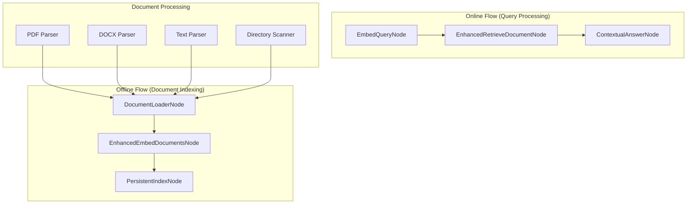

# Production-Ready RAG System

A production-ready Retrieval Augmented Generation (RAG) system built with PocketFlow that supports multiple document formats and provides robust document processing capabilities.

> **Having issues?** Jump to [Quick Fix](#-quick-fix-for-common-errors) or run `uv run debug_rag.py` for immediate diagnosis.

## 🚀 Features

### Document Processing
- **Multi-format support**: PDF, DOCX, TXT, MD, HTML files
- **Directory processing**: Recursively process entire folders
- **Smart chunking**: Context-aware text chunking with o## 🆘 Troubleshooting

### Common Issues

1. **Import errors**: Install missing dependencies with `uv sync`
2. **API key errors**: Ensure `GEMINI_API_KEY` is set in `.env` file
3. **File parsing errors**: Check file format and permissions
4. **Memory issues**: Reduce chunk size or process files in batches
5. **Index loading errors**: Delete existing index files to rebuild

### Error Messages and Solutions

**"No valid embeddings created"**: 
- This typically occurs when document parsing fails
- Check your document files and ensure they contain readable text
- Try reprocessing documents: `uv run main.py --query "test" --docs ./documents`

**"Query processing failed"**: 
- Often due to missing or corrupted index files
- Try rebuilding the index by removing `.faiss` files and running with `--docs` instead of `--use-existing-index`
- Check if texts and metadata files exist: `ls -la rag_index*`

**"Operation failed:" (empty message)**:
- This indicates an internal exception during query processing
- Check your API key and network connection
- Enable verbose logging with `--verbose` for more details
- Try a simpler query first: `uv run main.py --query "hello" --use-existing-index`
- If persistent, rebuild the index from scratch

**"HTTP Request failed" or API errors**:
- Verify `GEMINI_API_KEY` is set correctly in `.env` file
- Check your internet connection
- Ensure your API key has proper permissions
- Try waiting a moment and retrying (rate limiting)

**"Index loaded with X vectors" but no results**:
- Your query might be too complex or unrelated to document content
- Try simpler, more direct queries
- Lower the similarity threshold in config
- Check that `rag_index_texts.json` contains your expected text chunks

### Debugging Steps

When experiencing issues like "Operation failed:" with empty messages, follow these steps:

1. **Check Index Integrity**:
   ```bash
   # List all index files
   ls -la rag_index*
   
   # Check if texts file has content
   head -n 5 rag_index_texts.json
   ```

2. **Test API Connection**:
   ```bash
   # Create a simple test script
   echo 'import os; from dotenv import load_dotenv; load_dotenv(); print("API Key loaded:", bool(os.getenv("GEMINI_API_KEY")))' > test_api.py
   uv run python test_api.py
   ```

3. **Progressive Testing**:
   ```bash
   # Start simple
   uv run main.py --query "hello" --use-existing-index --verbose
   
   # Try document summarization
   uv run main.py --query "what is this about" --use-existing-index --verbose
   
   # If above work, try your original query
   uv run main.py --query "summarize the documents" --use-existing-index --verbose
   ```

4. **Rebuild Index if Necessary**:
   ```bash
   # Remove all index files
   rm rag_index*
   
   # Rebuild from documents
   uv run main.py --query "summarize the documents" --docs ./documents --verbose
   ```

5. **Check Document Content**:
   ```bash
   # Verify documents directory has content
   ls -la documents/
   
   # Check if documents are readable
   file documents/*
   ```ta preservation**: Track source files and chunk information

### Production Features
- **Persistent indexing**: Save and load FAISS indices
- **Error handling**: Robust error handling and logging
- **Configuration**: JSON-based configuration system
- **CLI interface**: Command-line tool for easy usage
- **Progress tracking**: Detailed logging and progress information

### Enhanced RAG Pipeline
- **Multiple document retrieval**: Get top-k relevant documents
- **Contextual answers**: Generate answers using multiple sources
- **Source attribution**: Track and cite source documents
- **Similarity filtering**: Filter results by similarity threshold

## 📦 Installation

1. Install dependencies:
   ```bash
   uv sync
   ```

2. Set up your Gemini API key:
   ```bash
   echo "GEMINI_API_KEY=your-api-key-here" > .env
   ```

3. Test the installation:
   ```bash
   # Test basic functionality
   uv run examples/basic_usage.py
   
   # Test with existing index (if available)
   uv run main.py --query "test query" --use-existing-index
   ```

## ⚡ Quick Fix for Common Errors

**Seeing "Operation failed:" with empty message?** Try this immediately:

```bash
# 1. Run the diagnostic tool
uv run debug_rag.py

# 2. Check if you have index files
ls -la rag_index*

# 3. If index files exist, try simple query with verbose output
uv run main.py --query "hello" --use-existing-index --verbose

# 4. If still failing, rebuild the index
rm rag_index* 2>/dev/null
uv run main.py --query "summarize documents" --docs ./documents --verbose
```

**API or environment issues?**
```bash
# Check your API key is set
echo "API Key set: $([ -n "$GEMINI_API_KEY" ] && echo "✓" || echo "✗")"

# If not set, create .env file
echo "GEMINI_API_KEY=your-api-key-here" > .env
```

## 🎯 Quick Start

### Basic Usage
```bash
# Process documents and query in one step
uv run main.py --query "What are the main topics?" --docs ./documents

# Process specific files
uv run main.py --query "How to install software?" --docs manual.pdf guide.docx readme.txt

# Use existing index (fast querying without re-indexing)
uv run main.py --query "Summarize the documents" --use-existing-index
```

> **Note**: If you get "Operation failed:" with an empty error message when using `--use-existing-index`, 
> your index might be corrupted. Try rebuilding it by removing the `--use-existing-index` flag and 
> specifying `--docs ./documents` instead.

### Advanced Usage

#### 1. Create Configuration File
```bash
uv run main.py --create-config
```

#### 2. Use Configuration File
```bash
uv run main.py --config config.json
```

#### 3. Save Results to File
```bash
uv run main.py --query "Your question" --use-existing-index --output results.json
```

### Example Queries for Document Analysis
```bash
# Comprehensive document summary
uv run main.py --query "Provide a comprehensive summary of all documents" --use-existing-index

# Extract key findings
uv run main.py --query "What are the key findings and conclusions?" --use-existing-index

# Methodology analysis
uv run main.py --query "What methodology was used in this research?" --use-existing-index

# Technical details
uv run main.py --query "What technical specifications are mentioned?" --use-existing-index
```

### Programmatic Usage

```python
from main import ProductionRAGSystem

# Initialize system
rag_system = ProductionRAGSystem()

# Process documents and query in one step
result = rag_system.run_full_pipeline(
    document_sources=["./documents", "manual.pdf"],
    query="What is the installation process?"
)

print("Answer:", result["query_result"]["answer"])

# Query existing index only
result = rag_system.query_documents("Summarize the key points")
print("Answer:", result["answer"])
```

## 📁 Supported File Types

- **PDF**: `.pdf` (using PyPDF2)
- **Word Documents**: `.docx`, `.doc` (using python-docx)
- **Text Files**: `.txt`
- **Markdown**: `.md`, `.markdown`
- **HTML**: `.html`, `.htm`

## ⚙️ Configuration

Create a configuration file to customize behavior:

```json
{
  "offline": {
    "chunk_size": 2000,
    "chunk_overlap": 200,
    "index_path": "rag_index.faiss",
    "save_index": true
  },
  "online": {
    "k": 5,
    "min_similarity_threshold": 0.0
  },
  "default_documents": ["./documents"],
  "default_query": "What is the main topic?"
}
```

### Configuration Options

#### Offline Processing
- `chunk_size`: Maximum characters per chunk (default: 2000)
- `chunk_overlap`: Characters to overlap between chunks (default: 200)
- `index_path`: Path to save FAISS index (default: "rag_index.faiss")
- `save_index`: Whether to persist index to disk (default: true)

#### Online Processing
- `k`: Number of documents to retrieve (default: 5)
- `min_similarity_threshold`: Minimum similarity for retrieval (default: 0.0)

## 📁 Project Structure

```
pocketflow-rag/
├── src/
│   └── rag_system/           # Core RAG system components
│       ├── __init__.py
│       ├── flow.py          # PocketFlow workflow definitions
│       ├── enhanced_nodes.py # Production-ready nodes with error handling
│       ├── document_parser.py # Multi-format document parsing
│       └── utils.py         # Core utilities (LLM, embeddings)
├── examples/                 # Usage examples and demos
│   ├── basic_usage.py       # Basic usage example
│   ├── query_existing_index.py # Query existing index example
│   └── simple_demo.py       # Simple demonstration
├── scripts/                  # Utility scripts
│   └── batch_processor.py   # Batch processing for large collections
├── config/                   # Configuration files
│   └── production_config.json # Production configuration template
├── documents/               # Sample documents directory
├── data/                    # Data storage directory
├── main.py                  # Main CLI interface
├── pyproject.toml          # Project dependencies
├── .env                    # Environment variables (create this)
├── rag_index.faiss         # FAISS index (generated)
├── rag_index_texts.json    # Text chunks (generated)
├── rag_index_chunks.json   # Chunk metadata (generated)
├── rag_index_metadata.json # Index metadata (generated)
└── README.md              # This file
```

## 🏗️ Architecture

The system uses a two-phase pipeline:



### Core Components

1. **DocumentLoaderNode**: Parses and chunks documents from files/directories
2. **EnhancedEmbedDocumentsNode**: Creates embeddings with error handling
3. **PersistentIndexNode**: Creates and saves FAISS index
4. **EmbedQueryNode**: Embeds user queries
5. **EnhancedRetrieveDocumentNode**: Retrieves multiple relevant documents
6. **ContextualAnswerNode**: Generates answers with source attribution

## 📚 Examples

### Directory Processing
```bash
# Process all supported files in a directory
uv run main.py \
  --query "What are the security requirements?" \
  --docs ./company_docs \
  --output results.json
```

### Multiple File Types
```bash
# Process mixed file types
uv run main.py \
  --query "How to deploy the application?" \
  --docs deployment_guide.pdf setup.md config.txt
```

### Configuration-Based
```bash
# Use configuration file
uv run main.py --config config/production_config.json
```

### Interactive Example Usage
```bash
# Run interactive query session
uv run examples/query_existing_index.py --interactive

# Run predefined queries
uv run examples/query_existing_index.py

# Single query
uv run examples/query_existing_index.py --query "What are the main findings?"
```

```python
# Custom configuration
config = {
    "offline": {
        "chunk_size": 1500,
        "chunk_overlap": 300,
        "index_path": "custom_index.faiss"
    },
    "online": {
        "k": 10,
        "min_similarity_threshold": 0.1
    }
}

rag_system = ProductionRAGSystem(config)
result = rag_system.run_full_pipeline(docs, query)
```

## 🚀 Production Deployment

### Large Document Collections

For processing large document collections efficiently:

```bash
# Process a directory with thousands of documents
uv run main.py \
  --query "What are the compliance requirements?" \
  --docs ./legal_documents \
  --config config/production_config.json \
  --verbose

# Query existing index for fast responses
uv run main.py \
  --query "Find technical specifications" \
  --use-existing-index \
  --output batch_results.json
```

### Batch Processing for Large Collections

For processing thousands of documents efficiently:

```bash
# Process entire directory tree
uv run scripts/batch_processor.py \
  --directory ./company_documents \
  --config config/production_config.json \
  --max-size 100

# Process specific file types only
uv run scripts/batch_processor.py \
  --directory ./legal_docs \
  --patterns "*.pdf" "*.docx" \
  --config batch_config.json
```

The batch processor provides:
- **Progress tracking**: Checkpoints and detailed logging
- **Error handling**: Continue processing even if some files fail
- **Memory management**: Process files in configurable batches
- **Performance metrics**: Documents per minute, success rates
- **Resume capability**: Restart from checkpoints

### Configuration for Production

Create `config/production_config.json` for optimal performance:

```json
{
  "offline": {
    "chunk_size": 1500,
    "chunk_overlap": 300,
    "index_path": "production_index.faiss",
    "save_index": true,
    "batch_size": 100
  },
  "online": {
    "k": 10,
    "min_similarity_threshold": 0.15
  },
  "document_parser": {
    "max_file_size_mb": 50,
    "skip_empty_files": true,
    "extract_metadata": true
  }
}
```

### Docker Deployment

```dockerfile
FROM python:3.12-slim

WORKDIR /app
COPY pyproject.toml uv.lock ./
RUN pip install uv && uv sync

COPY . .
ENV GEMINI_API_KEY=your_key_here

CMD ["uv", "run", "main.py", "--config", "config/production_config.json"]
```

### Monitoring and Logging

Enable comprehensive logging for production:

```bash
# Enable debug logging
uv run main.py \
  --query "Your query" \
  --docs ./documents \
  --verbose \
  2>&1 | tee rag_system.log
```

## 🔧 Development

### Running Tests
```bash
uv run examples/basic_usage.py
```

### Adding New File Types

1. Add parser to `src/rag_system/document_parser.py`:
```python
def _parse_new_format(self, file_path: Path) -> str:
    # Implementation here
    pass
```

2. Update `SUPPORTED_EXTENSIONS` dictionary
3. Add format handling in `parse_file` method

### Custom Chunking Strategies

Extend the `DocumentParser` class:
```python
from src.rag_system.document_parser import DocumentParser

class CustomDocumentParser(DocumentParser):
    def smart_chunk_text(self, text, metadata):
        # Custom chunking logic
        pass
```

## 🚨 Error Handling

The system includes comprehensive error handling:

- **File parsing errors**: Individual file failures don't stop the pipeline
- **Embedding errors**: Zero vectors used for failed embeddings
- **Index persistence**: Graceful handling of index save/load failures
- **Missing dependencies**: Clear error messages for optional dependencies

## 📈 Performance Tips

1. **Chunk size**: Smaller chunks (1000-1500) for precise retrieval, larger (2000-3000) for context
2. **Overlap**: Use 10-20% of chunk size for overlap
3. **Retrieval count**: Start with k=5, increase for comprehensive answers
4. **Index persistence**: Save indices for repeated queries on same documents

## 🤝 Migration from Legacy

If you had a previous version or encountered issues:

1. The main interface is now `main.py` (unified interface)
2. Use `--use-existing-index` for fast querying without re-indexing
3. All index files are automatically generated and managed
4. Check that your `.env` file contains `GEMINI_API_KEY`
5. Use configuration files for consistent behavior

## 🆘 Troubleshooting

### Common Issues

1. **Import errors**: Install missing dependencies with `uv sync`
2. **API key errors**: Ensure `GEMINI_API_KEY` is set in `.env` file
3. **File parsing errors**: Check file format and permissions
4. **Memory issues**: Reduce chunk size or process files in batches
5. **Index loading errors**: Delete existing index files to rebuild

### Error Messages

**"No valid embeddings created"**: This typically occurs when document parsing fails. Check your document files and ensure they contain readable text.

**"Query processing failed"**: Often due to missing or corrupted index files. Try rebuilding the index by removing `.faiss` files and running with `--docs` instead of `--use-existing-index`.

**"Operation failed"**: Check your API key and network connection. Enable verbose logging with `--verbose` for more details.

### Getting Help

- Check the examples in `examples/` directory
- Review configuration options in `config/production_config.json`
- Enable verbose logging with `--verbose` flag
- Test with the provided sample documents in `documents/`
- Use the interactive mode: `uv run examples/query_existing_index.py --interactive`

### Specific Issue: "Operation failed:" with Empty Message

If you're seeing the exact error pattern:
```
ERROR:__main__:Query processing failed: 
ERROR:__main__:Operation failed: 
```

This typically indicates an exception in the query processing pipeline. Try these solutions in order:

1. **Immediate Fix - Test with verbose logging**:
   ```bash
   uv run main.py --query "test" --use-existing-index --verbose
   ```

2. **Check index file integrity**:
   ```bash
   # These files should exist and have content
   ls -la rag_index.faiss rag_index_texts.json rag_index_metadata.json
   ```

3. **Try a fresh index rebuild**:
   ```bash
   # Remove existing index
   rm rag_index*
   
   # Rebuild with documents
   uv run main.py --query "summarize" --docs ./documents --verbose
   ```

4. **Test API connectivity**:
   ```bash
   # Test basic embedding
   uv run examples/basic_usage.py
   ```

5. **Use the working example**:
   ```bash
   # This should work if your index is valid
   uv run examples/query_existing_index.py
   ```

## ✅ System Verification

To verify your system is working correctly:

```bash
# 1. Check if index exists
ls -la rag_index*

# 2. Test query with existing index
uv run main.py --query "What is this about?" --use-existing-index

# 3. Test document processing
uv run main.py --query "Summarize" --docs ./documents --verbose

# 4. Run example queries
uv run examples/query_existing_index.py
```

The system is working correctly when:
- Index files are created (`rag_index.faiss`, `rag_index_texts.json`, etc.)
- Queries return relevant answers with source attribution
- No "Operation failed" errors occur
- Retrieved documents show similarity scores > 0.3

## 📄 License

This project is part of the PocketFlow cookbook examples.
